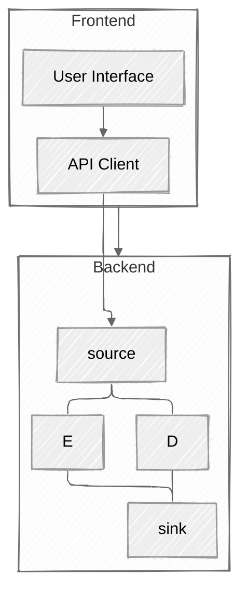

```mermaid
---
config:
        look: handDrawn   # handDrawn, classic
        theme: neutral    # neutral, default
        layout: elk       # elk, dagre
        elk:
                mergeEdges: true
                nodePlacementStrategy: LINEAR_SEGMENTS
---
flowchart TD
        subgraph Frontend
                A[User Interface] --> B[API Client]
        end
        subgraph Backend
                direction LR
                B --> C[Authentication]
                C[source] --- D & E --- S[sink]
        end

Frontend --> Backend
```
